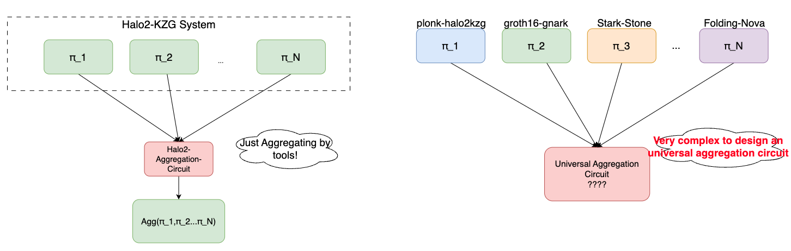

# Introduction

Now there are a variety of Zero Knowledge Proof Systems in the Ethereum ecology. Paring-based systems like Groth16, [Halo2-KZG](https://github.com/privacy-scaling-explorations/halo2), and Hash-based systems like [ZK-STARK](https://github.com/starkware-libs/stone-prover), [Plonky2](https://github.com/0xPolygonZero/plonky2), all these proof systems' verification overhead are still relatively **high** for the time being.

Reducing ZKP Verification's Overhead By Leveraging Type1 ZK-EVM & ZK-SPV

## The Lifetime of Proof

## Proofs Overhead

The overhead of Zero Knowledge Proofs is divided into the following two parts:

### Off-chain Computation

When it comes to the scenario of large-scale continuation proof([ZKML](https://worldcoin.org/blog/engineering/intro-to-zkml),[ZK Coprocessor](https://blog.axiom.xyz/what-is-a-zk-coprocessor/) etc.)

### On-chain Verification

## Proofs Aggregation Challenge

Proofs Aggregation Scheme for different ZKP Systems and development tools is much more complex than aggregating the proofs for the same ZKP System & development tool.

For example, if you are a Halo2-KZG based ZK developer, you can easily aggregate the Proofs generated by Halo2-KZG to reduce gas cost of proofs' verification [by utilizing the aggregation circuit in snark-verifier](https://github.com/privacy-scaling-explorations/snark-verifier/blob/371ddb59064080170cd2c77fc84ec4d8abbe4a43/snark-verifier/examples/evm-verifier-with-accumulator.rs#L603)

If you plan to aggregate proofs from different KZP Systems by a specific aggregation circuit, this would be a very [hard cryptography challenge](https://eprint.iacr.org/2020/499)

## End Game: A Turing Complete ZK-VM for proof recursion

### Leveraging The Power Of Type-1 ZK-EVM

### Verify Your ZKP On Chain By EVM Bytecode
Many ZKP development tools have their own solidity/yul code automation generator, like Halo2-KZG's [snark-verifier](https://github.com/privacy-scaling-explorations/snark-verifier), [circom](https://docs.circom.io/getting-started/proving-circuits/#verifying-from-a-smart-contract),[gnark](https://docs.gnark.consensys.io/HowTo/prove#verify-a-proof-on-ethereum)

## Exclusive Features

### Cryptography Security 
The system is purely built **based on existing Zero Knowledge Proof Primitives**. The correctness of the proofs aggregation **does not be guaranteed or trusted by any third-party consensus layer** till you verify the proofs on your destination side

### Permissionless 
The platform will be an open network for Proof Submitter, you just need to deploy your Proof verification solidity/yul code to the network and submit the proof to execute your own verification smart contract

### Extremely Low Gas Overhead

Gas costs will be reduced by at least multiples, The more proofs are aggregated, the more times the cost is reduced.

## Use Cases

